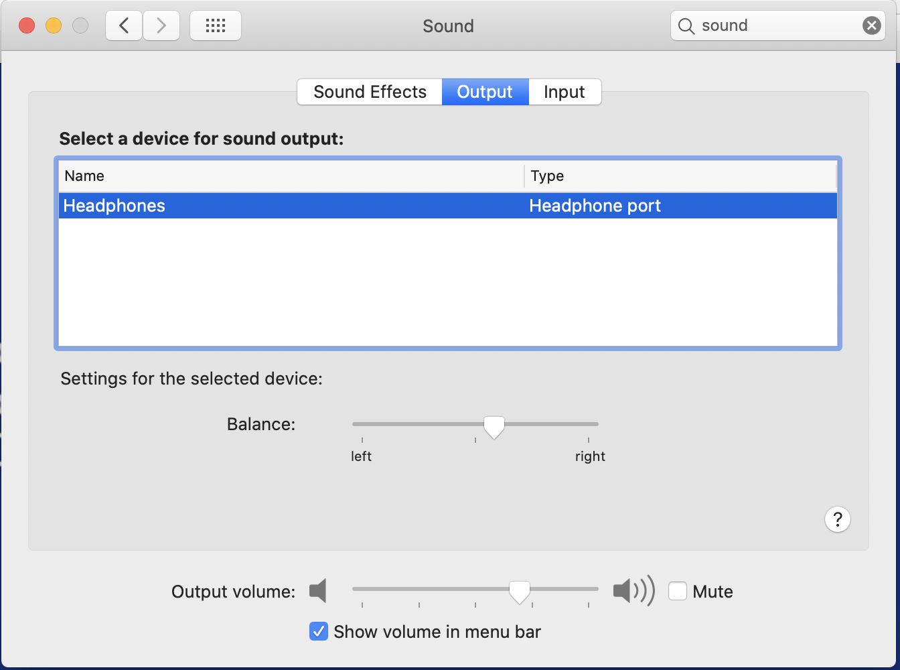

# How to fix audio output from earphone after mac upgrade
---
The following are the step by step instruction to resolve the earphone audio output issue after mac upgrade

## Step 1: Open the `System Preferences` by clicking `command + space` and select `Sound` in it.

